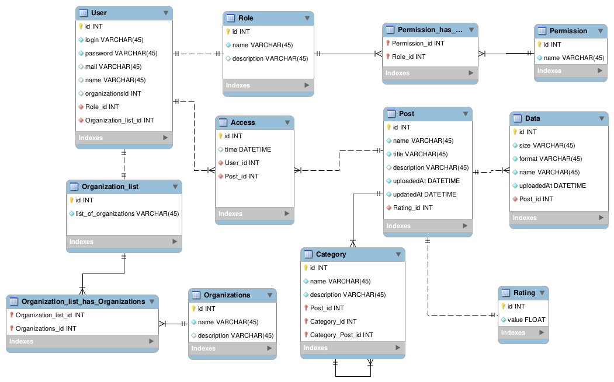

# Проєктування бази даних

В рамках проекту розробляється: 
- модель бізнес-об'єктів 
- ER-модель
- реляційна схема

## Модель бізнес-об'єктів

@startuml
entity User <<ENTITY>> #ffe396
entity User.password <<TEXT>> #fcf4dc
entity User.mail <<TEXT>> #fcf4dc
entity User.login <<TEXT>> #fcf4dc
entity Role <<ENTITY>> #ffe396
entity User.name <<TEXT>> #fcf4dc
entity User.id <<NUMBER>> #fcf4dc

User.password -d-* User
User.mail -d-* User
User.login -r-* User
Role "1.1"--"0.*" User
User.name -d-* User
User.id -d-* User

entity Role.name <<TEXT>> #fcf4dc
entity Role.id <<NUMBER>> #fcf4dc

Role.name -d-* Role
Role.id -d-* Role

entity Permission_has_Role <<ENTITY>> #ffe396

Permission_has_Role "0.*"-d-"1.1" Role

entity Permission <<ENTITY>> #ffe396
entity Permission.id <<NUMBER>> #fcf4dc
entity Permission.name <<TEXT>> #fcf4dc

Permission "1.1"-r-"0.0" Permission_has_Role
Permission.id -d-* Permission
Permission.name -d-* Permission

entity Organization <<ENTITY>> #ffe396
entity Organization.id <<NUMBER>> #fcf4dc
entity Organization.name <<TEXT>> #fcf4dc
entity Organization.description <<TEXT>> #fcf4dc

Organization.id -l-* Organization
Organization.name -d-* Organization
Organization.description -d-* Organization

entity Organization_list_has_Organizations <<ENTITY>> #ffe396

Organization "1.1"-d-"0.*" Organization_list_has_Organizations

entity Organization_list <<ENTITY>> #ffe396
entity Organization_list.id <<NUMBER>> #fcf4dc
entity Organization_list.list_of_organizations <<TEXT>> #fcf4dc

Organization_list_has_Organizations "0.*"-d-"1.1" Organization_list
Organization_list.id -d-* Organization_list
Organization_list.list_of_organizations -l-* Organization_list
Organization_list "1.1"-l-"0.*" User

entity Access <<ENTITY>> #ffe396
entity Access.id <<NUMBER>> #fcf4dc
entity Access.time <<DATETIME>> #fcf4dc

User "1.1"-d-"0.*" Access
Access.id -r-* Access
Access.time -l-* Access

entity Post <<ENTITY>> #ffe396
entity Post.id <<NUMBER>> #fcf4dc
entity Post.name <<TEXT>> #fcf4dc
entity Post.title <<TEXT>> #fcf4dc
entity Post.description <<TEXT>> #fcf4dc
entity Post.uploadedAt <<DATETIME>> #fcf4dc
entity Post.updatedAt <<DATETIME>> #fcf4dc

Access "0.*"-d-"1.1" Post

Post.id -u-* Post
Post.name -u-* Post
Post.title -u-* Post
Post.description -u-* Post
Post.uploadedAt -u-* Post
Post.updatedAt -u-* Post

entity Data <<ENTITY>> #ffe396
entity Data.id <<NUMBER>> #fcf4dc
entity Data.name <<TEXT>> #fcf4dc
entity Data.format <<TEXT>> #fcf4dc
entity Data.size <<TEXT>> #fcf4dc
entity Data.uploadedAt <<DATETIME>> #fcf4dc

Data "0.*"-l-"1.1" Post
Data.id -d-* Data
Data.name -u-* Data
Data.format -l-* Data
Data.size -d-* Data
Data.uploadedAt -u-* Data

entity Category <<ENTITY>> #ffe396
entity Category.id <<NUMBER>> #fcf4dc
entity Category.name <<TEXT>> #fcf4dc
entity Category.description <<TEXT>> #fcf4dc

Category "0.1"--"0.*" Category
Category "0.*"-r-"1.1" Post
Category.name -u-* Category
Category.id -u-* Category
Category.description -r-* Category

entity Rating <<ENTITY>> #ffe396
entity Rating.id <<NUMBER>> #fcf4dc
entity Rating.value <<NUMBER>> #fcf4dc

Rating "1.1"-r-"0.*" Post
Rating.value -u-* Rating
Rating.id -d-* Rating

@enduml

## ER-модель

@startuml

entity "User" <<ENTITY>>  {
  + id <<INT>>
  + login <<TEXT>> 
  + password <<TEXT>> 
  + mail <<TEXT>> 
  + name <<TEXT>>  
  + roleID <<INT>>
  + organizations_listID <<INT>> 
}

entity "Role" <<ENTITY>>  {
  + id <<INT>> 
  + name <<TEXT>>
  + description <<Text>>
}

entity "Permission_has_Role" {
  + permissionId <<INT>>
  + roleId  <<INT>>
}

entity "Permission" <<ENTITY>> {
  + id <<INT>>
  + name <<TEXT>>
}

entity Organization_list <<ENTITY>> {
  + id <<INT>>
  + list_of_organizations <<TEXT>>
}

entity "Organization_list_has_Organizations" <<ENTITY>> {
  + organization_listID <<INT>>
  + organizationsId <<INT>>
}

entity "Organizations" <<ENTITY>>  {
  + id <<INT>> 
  + name <<TEXT>> 
  + description <<TEXT>> 
}

entity "Access" <<ENTITY>>  {
  + id <<INT>> 
  + time <<DATETIME>> 
  + UserID <<INT>>
  + PostID <<INT>>
}
entity "Post" <<ENTITY>>  {
  + id <<INT>> 
  + name <<TEXT>> 
  + title <<TEXT>> 
  + description <<TEXT>> 
  + uploadedAt <<DATETIME>> 
  + updatedAt <<DATETIME>> 
  + RatingID <<INT>>
  + DataID <<INT>>
}

entity "Data" <<ENTITY>>  {
  + id <<INT>> 
  + name <<TEXT>> 
  + format <<TEXT>> 
  + size <<TEXT>> 
  + uploadedAt <<DATETIME>> 
}

entity "Category" <<ENTITY>>  {
  + id <<INT>> 
  + name <<TEXT>> 
  + description <<TEXT>> 
  + PostID <<INT>>
  + CategoryID <<INT>>
  + Category_PostID <<INT>>
}

entity "Rating" <<ENTITY>>  {
  + id <<INT>> 
  + value <<FLOAT>> 
}

Role "1.1"-l->"0.*" User
Permission_has_Role "0.*"-l->"1.1" Role
Permission "1.1"-d->"0.*" Permission_has_Role
Organizations "1.1"-r->"0.*" Organization_list_has_Organizations
Organization_list_has_Organizations "0.*"-d->"1.1" Organization_list
Organization_list "1.1"-r->"0.*" User
User "1.1"-d->"0.*" Access
Access "0.*"-d->"1.1" Post
Category "1.1"-l->"0.*" Post
Category "0.1"-r->"0.*" Category
Rating "1.1"-d->"0.*" Post
Data "0.*"-r->"1.1" Post

@enduml

## Relation Scheme

