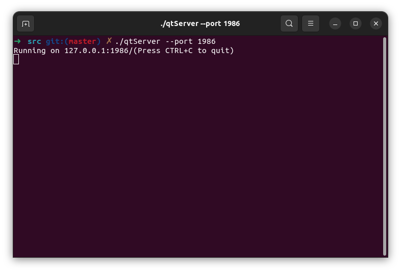

# Реалізація інформаційного та програмного забезпечення

В рамках проекту розробляється:
- ~~SQL-скрипт для створення початкового наповнення бази даних~~
- RESTfull сервіс для управління даними

## SQL-Скрипт для створення початкового наповнення бази даних
```sql
-- MySQL Workbench Forward Engineering

SET @OLD_UNIQUE_CHECKS=@@UNIQUE_CHECKS, UNIQUE_CHECKS=0;
SET @OLD_FOREIGN_KEY_CHECKS=@@FOREIGN_KEY_CHECKS, FOREIGN_KEY_CHECKS=0;
SET @OLD_SQL_MODE=@@SQL_MODE, SQL_MODE='ONLY_FULL_GROUP_BY,STRICT_TRANS_TABLES,NO_ZERO_IN_DATE,NO_ZERO_DATE,ERROR_FOR_DIVISION_BY_ZERO,NO_ENGINE_SUBSTITUTION';

-- -----------------------------------------------------
-- Schema mydb
-- -----------------------------------------------------
DROP SCHEMA IF EXISTS `mydb` ;

-- -----------------------------------------------------
-- Schema mydb
-- -----------------------------------------------------
CREATE SCHEMA IF NOT EXISTS `mydb` DEFAULT CHARACTER SET utf8 ;
USE `mydb` ;

-- -----------------------------------------------------
-- Table `mydb`.`Organization_list`
-- -----------------------------------------------------
DROP TABLE IF EXISTS `mydb`.`Organization_list` ;

CREATE TABLE IF NOT EXISTS `mydb`.`Organization_list` (
  `id` INT NOT NULL AUTO_INCREMENT,
  `list_of_organizations` VARCHAR(45) NOT NULL,
  PRIMARY KEY (`id`))
ENGINE = InnoDB;


-- -----------------------------------------------------
-- Table `mydb`.`Role`
-- -----------------------------------------------------
DROP TABLE IF EXISTS `mydb`.`Role` ;

CREATE TABLE IF NOT EXISTS `mydb`.`Role` (
  `id` INT NOT NULL AUTO_INCREMENT,
  `name` VARCHAR(45) NOT NULL,
  `description` VARCHAR(45) NULL,
  PRIMARY KEY (`id`))
ENGINE = InnoDB;


-- -----------------------------------------------------
-- Table `mydb`.`User`
-- -----------------------------------------------------
DROP TABLE IF EXISTS `mydb`.`User` ;

CREATE TABLE IF NOT EXISTS `mydb`.`User` (
  `id` INT NOT NULL AUTO_INCREMENT,
  `login` VARCHAR(45) NOT NULL,
  `password` VARCHAR(45) NOT NULL,
  `mail` VARCHAR(45) NULL,
  `name` VARCHAR(45) NULL,
  `Organization_list_id` INT NOT NULL,
  `Role_id` INT NOT NULL,
  PRIMARY KEY (`id`, `Organization_list_id`),
  UNIQUE INDEX `login_UNIQUE` (`login` ASC) VISIBLE,
  INDEX `fk_User_Organization_list1_idx` (`Organization_list_id` ASC) VISIBLE,
  INDEX `fk_User_Role1_idx` (`Role_id` ASC) VISIBLE,
  CONSTRAINT `fk_User_Organization_list1`
    FOREIGN KEY (`Organization_list_id`)
    REFERENCES `mydb`.`Organization_list` (`id`)
    ON DELETE NO ACTION
    ON UPDATE NO ACTION,
  CONSTRAINT `fk_User_Role1`
    FOREIGN KEY (`Role_id`)
    REFERENCES `mydb`.`Role` (`id`)
    ON DELETE NO ACTION
    ON UPDATE NO ACTION)
ENGINE = InnoDB;


-- -----------------------------------------------------
-- Table `mydb`.`Rating`
-- -----------------------------------------------------
DROP TABLE IF EXISTS `mydb`.`Rating` ;

CREATE TABLE IF NOT EXISTS `mydb`.`Rating` (
  `id` INT NOT NULL AUTO_INCREMENT,
  `value` FLOAT NOT NULL,
  PRIMARY KEY (`id`))
ENGINE = InnoDB;


-- -----------------------------------------------------
-- Table `mydb`.`Data`
-- -----------------------------------------------------
DROP TABLE IF EXISTS `mydb`.`Data` ;

CREATE TABLE IF NOT EXISTS `mydb`.`Data` (
  `id` INT NOT NULL AUTO_INCREMENT ,
  `size` VARCHAR(45) NOT NULL,
  `format` VARCHAR(45) NOT NULL,
  `name` VARCHAR(45) NOT NULL,
  `uploadedAt` DATETIME NOT NULL,
  PRIMARY KEY (`id`))
ENGINE = InnoDB;


-- -----------------------------------------------------
-- Table `mydb`.`Post`
-- -----------------------------------------------------
DROP TABLE IF EXISTS `mydb`.`Post` ;

CREATE TABLE IF NOT EXISTS `mydb`.`Post` (
  `id` INT NOT NULL AUTO_INCREMENT,
  `name` VARCHAR(45) NOT NULL,
  `title` VARCHAR(45) NOT NULL,
  `description` VARCHAR(45) NULL,
  `uploadedAt` DATETIME NOT NULL,
  `updatedAt` DATETIME NOT NULL,
  `Rating_id` INT NOT NULL,
  `Data_id` INT NOT NULL,
  PRIMARY KEY (`id`, `Rating_id`, `Data_id`),
  INDEX `fk_Post_Rating1_idx` (`Rating_id` ASC) VISIBLE,
  INDEX `fk_Post_Data1_idx` (`Data_id` ASC) VISIBLE,
  CONSTRAINT `fk_Post_Rating1`
    FOREIGN KEY (`Rating_id`)
    REFERENCES `mydb`.`Rating` (`id`)
    ON DELETE NO ACTION
    ON UPDATE NO ACTION,
  CONSTRAINT `fk_Post_Data1`
    FOREIGN KEY (`Data_id`)
    REFERENCES `mydb`.`Data` (`id`)
    ON DELETE NO ACTION
    ON UPDATE NO ACTION)
ENGINE = InnoDB;


-- -----------------------------------------------------
-- Table `mydb`.`Access`
-- -----------------------------------------------------
DROP TABLE IF EXISTS `mydb`.`Access` ;

CREATE TABLE IF NOT EXISTS `mydb`.`Access` (
  `id` INT NOT NULL AUTO_INCREMENT,
  `time` DATETIME NOT NULL,
  `User_id` INT NOT NULL,
  `Post_id` INT NOT NULL,
  PRIMARY KEY (`id`),
  INDEX `fk_Access_User1_idx` (`User_id` ASC) VISIBLE,
  INDEX `fk_Access_Post1_idx` (`Post_id` ASC) VISIBLE,
  CONSTRAINT `fk_Access_User1`
    FOREIGN KEY (`User_id`)
    REFERENCES `mydb`.`User` (`id`)
    ON DELETE NO ACTION
    ON UPDATE NO ACTION,
  CONSTRAINT `fk_Access_Post1`
    FOREIGN KEY (`Post_id`)
    REFERENCES `mydb`.`Post` (`id`)
    ON DELETE NO ACTION
    ON UPDATE NO ACTION)
ENGINE = InnoDB;


-- -----------------------------------------------------
-- Table `mydb`.`Category`
-- -----------------------------------------------------
DROP TABLE IF EXISTS `mydb`.`Category` ;

CREATE TABLE IF NOT EXISTS `mydb`.`Category` (
  `id` INT NOT NULL AUTO_INCREMENT,
  `name` VARCHAR(45) NOT NULL,
  `description` VARCHAR(45) NOT NULL,
  `Category_id` INT NOT NULL,
  `Post_id` INT NOT NULL,
  PRIMARY KEY (`id`, `Post_id`, `Category_id`),
  INDEX `fk_Category_Post1_idx` (`Post_id` ASC) VISIBLE,
  CONSTRAINT `fk_Category_Post1`
    FOREIGN KEY (`Post_id`)
    REFERENCES `mydb`.`Post` (`id`)
    ON DELETE NO ACTION
    ON UPDATE NO ACTION)
ENGINE = InnoDB;


-- -----------------------------------------------------
-- Table `mydb`.`Permission`
-- -----------------------------------------------------
DROP TABLE IF EXISTS `mydb`.`Permission` ;

CREATE TABLE IF NOT EXISTS `mydb`.`Permission` (
  `id` INT NOT NULL AUTO_INCREMENT,
  `name` VARCHAR(45) NOT NULL,
  PRIMARY KEY (`id`))
ENGINE = InnoDB;


-- -----------------------------------------------------
-- Table `mydb`.`Permission_has_Role`
-- -----------------------------------------------------
DROP TABLE IF EXISTS `mydb`.`Permission_has_Role` ;

CREATE TABLE IF NOT EXISTS `mydb`.`Permission_has_Role` (
  `Permission_id` INT NOT NULL,
  `Role_id` INT NOT NULL,
  PRIMARY KEY (`Permission_id`, `Role_id`),
  INDEX `fk_Permission_has_Role_Role1_idx` (`Role_id` ASC) VISIBLE,
  INDEX `fk_Permission_has_Role_Permission1_idx` (`Permission_id` ASC) VISIBLE,
  CONSTRAINT `fk_Permission_has_Role_Permission1`
    FOREIGN KEY (`Permission_id`)
    REFERENCES `mydb`.`Permission` (`id`)
    ON DELETE NO ACTION
    ON UPDATE NO ACTION,
  CONSTRAINT `fk_Permission_has_Role_Role1`
    FOREIGN KEY (`Role_id`)
    REFERENCES `mydb`.`Role` (`id`)
    ON DELETE NO ACTION
    ON UPDATE NO ACTION)
ENGINE = InnoDB;


-- -----------------------------------------------------
-- Table `mydb`.`Organizations`
-- -----------------------------------------------------
DROP TABLE IF EXISTS `mydb`.`Organizations` ;

CREATE TABLE IF NOT EXISTS `mydb`.`Organizations` (
  `id` INT NOT NULL AUTO_INCREMENT,
  `name` VARCHAR(45) NOT NULL,
  `description` VARCHAR(45) NULL,
  PRIMARY KEY (`id`))
ENGINE = InnoDB;


-- -----------------------------------------------------
-- Table `mydb`.`Organization_list_has_Organizations`
-- -----------------------------------------------------
DROP TABLE IF EXISTS `mydb`.`Organization_list_has_Organizations` ;

CREATE TABLE IF NOT EXISTS `mydb`.`Organization_list_has_Organizations` (
  `Organization_list_id` INT NOT NULL,
  `Organizations_id` INT NOT NULL,
  PRIMARY KEY (`Organization_list_id`, `Organizations_id`),
  INDEX `fk_Organization_list_has_Organizations_Organizations1_idx` (`Organizations_id` ASC) VISIBLE,
  INDEX `fk_Organization_list_has_Organizations_Organization_list1_idx` (`Organization_list_id` ASC) VISIBLE,
  CONSTRAINT `fk_Organization_list_has_Organizations_Organization_list1`
    FOREIGN KEY (`Organization_list_id`)
    REFERENCES `mydb`.`Organization_list` (`id`)
    ON DELETE NO ACTION
    ON UPDATE NO ACTION,
  CONSTRAINT `fk_Organization_list_has_Organizations_Organizations1`
    FOREIGN KEY (`Organizations_id`)
    REFERENCES `mydb`.`Organizations` (`id`)
    ON DELETE NO ACTION
    ON UPDATE NO ACTION)
ENGINE = InnoDB;


SET SQL_MODE=@OLD_SQL_MODE;
SET FOREIGN_KEY_CHECKS=@OLD_FOREIGN_KEY_CHECKS;
SET UNIQUE_CHECKS=@OLD_UNIQUE_CHECKS;

--  Inserting Permissions, that roles can own --
Insert Into mydb.permission (name) VALUES
	('Create'),
    ('Edit'),
    ('Delete'),
    ('Execute');

-- Inserting Roles --
Insert into `mydb`.`role` (name, description) VALUES
	('sadmin', 'System Administrator'),
    ('Developer', 'System Developer'),
    ('Moderator', 'Moderator'),
    ('User', 'User');


-- Correlating Roles with Permissions --
Insert into mydb.permission_has_role (Role_id, Permission_id) VALUES
	(1, 1),
    (1, 2),
    (1, 3),
	(2, 1),
    (2, 2),
    (2, 3),
    (2, 4),
    (3, 1),
    (3, 3);

-- Creating Organizations list for new Users --
Insert Into mydb.organization_list (list_of_organizations) Values
	('user1_login'),
    ('user2_login'),
    ('user3_login'),
    ('user4_login');

-- Creating new Users with org.list id from prev action and role id --
Insert into mydb.user (login, password, mail, name, Organization_list_id, Role_id) Values
	('user1_login', 'qwerty123', 'user1_login@gamil.com', 'User 1', 1, 1),
    ('user2_login', 'qwerty123', 'user2_login@gamil.com', 'User 2', 2, 2),
    ('user3_login', 'qwerty123', 'user3_login@gamil.com', 'User 3', 3, 3),
    ('user4_login', 'qwerty123', 'user4_login@gamil.com', 'User 4', 4, 4);

-- Creating organizations --
Insert into mydb.organizations (name, description) Values
	('Organization A', 'Provides some goods for A Group'),
    ('Organization B', 'Provides some goods for B Group'),
    ('Organization C', 'Provides some goods for C Group');

-- Inserting organizations into user's org.list --
Insert into mydb.organization_list_has_organizations
	(Organization_list_id, Organizations_id)
    Values
	(1, 3),
    (1, 2),
    (1, 1),
    (2, 1),
    (2, 2),
    (3, 1),
    (4, 2);

-- Inserting data info before post creating --
Insert Into mydb.data (size, format, name, uploadedAt) Values
	('2.5mb', 'png', 'png1', '2023-11-16'),
    ('3.1mb', 'png', 'png2', '2023-11-16'),
    ('1.7mb', 'png', 'png3', '2023-11-16');

-- Inserting data info before post creating --
INSERT INTO `mydb`.`Data` (`size`, `format`, `name`, `uploadedAt`) VALUES 
	('2.5mb', 'png', 'png1', '2023-11-16'),
    ('3.1mb', 'png', 'png2', '2023-11-16'),
    ('1.7mb', 'png', 'png3', '2023-11-16');
    
    
-- Inserting Def. rating for each post --
Insert into mydb.rating (value) Values
	(0.0),
    (0.0),
    (0.0);


-- Creating Post --
Insert into mydb.post
	(
		name, title, description, uploadedAt, updatedAt, Rating_id, Data_id
	) Values
	(
		'first Post', 'Usage of DB1', 'lorem ipsum Description', '2023-11-16', '2023-11-16', 1, 1
    ),
    (
		'Second Post', 'Usage of DB2', 'lorem ipsum Description', '2023-11-16', '2023-11-16', 2, 2
    ),
    (
		'Third Post', 'Usage of DB3', 'lorem ipsum Description', '2023-11-16', '2023-11-16', 3, 3
    );

-- Adding Access info for each post and specific users --
Insert into mydb.access (time, User_id, Post_id) Values
	('2023-11-16', 1, 1),
    ('2023-11-16', 1, 2),
    ('2023-11-16', 3, 3);

-- Correlating Categories with posts --
Insert into mydb.category (name, description, Post_id, Category_id) Values
	('Abstract cat name1', 'abc description', 1, 1),
	('Abstract cat name1', 'abc description', 2, 1),
	('Abstract cat name2', 'abc description', 3, 2);
```


## RESTfull сервіс для управління даними

###  Старт програми (main)

    Починає виконання програми.
    Створює екземпляр сервера і налаштовує його порт.
    При необхідності саме за допомогою цього модуля варто об'єднувати серверну частину застосунку і, можливо, користувацький інтерфейс

Пояснення:

    У цьому модулі підключаються необхідні бібліотеки для програми та файл серверу server.h

    Також у ньому виконується обробка парамертрів командного рядка: Парсер командного рядка може налаштовувати деякі параметри при запуску серверу, у нашому прикладі - можна встановити власний порт перед запуском.
<p align="center">
      
</p>


```cpp
#include <QCoreApplication>
#include <QCommandLineParser>
#include "server.h"

int main(int argc, char *argv[])
{
    QCoreApplication app(argc, argv);
    QCommandLineParser parser;

    parser.addOptions({
                       { "port", QCoreApplication::translate("main", "The port the server listens on."),
                        "port" },
                       });
    parser.addHelpOption();
    parser.process(app);

    QString host = "127.0.0.1";
    quint16 portArg = 1337;
    if (!parser.value("port").isEmpty())
        portArg = parser.value("port").toUShort();

    BasicHttpServer server{host, portArg};
    server.setupRoutes();

    return app.exec();
}

```

### Модeль сервера(server.h)

    Описує клас сервера і методи для обробки різних типів запитів (GET, POST, PATCH, DELETE).

Пояснення:

    У цьому модулі налаштовується власне сервер, який забезпечує підключення до бази даних, 
    налаштовує роутинг шляхів для клієнтських реквестів, і підключає відповідні функції від нашого RESTful api

```cpp
#ifndef SERVER_H
#define SERVER_H

#include <QHttpServer>
#include <QHttpServerResponse>
#include <QCoreApplication>

#include "connecttodb.h"
#include "dataCrudApi.h"

class BasicHttpServer{
private:
    QHttpServer httpServer;
    QSqlDatabase *db;
    QSqlQuery *query;
    DataCrudApi *api;
    int port;
public:
    BasicHttpServer(QString host = "127.0.0.1", int port = 1337){
        ConnectionToDB connect;
        if (connect.conectToDb()) db = connect.getDB();
        query = new QSqlQuery(*db);
        api = new DataCrudApi(db);
        qInfo().noquote()
            << QCoreApplication::translate("QHttpServerExample",
                                           "Running on %1:%2/"
                                           "(Press CTRL+C to quit)").arg(host).arg(port);
        port = httpServer.listen(QHostAddress(host), port);

        if (!port) {
            qWarning() << QCoreApplication::translate("QHttpServerExample",
                                                      "Server failed to listen on a port.");
        }
    }

    void setupRoutes(){
        DataCrudApi thisApi = *api;
        httpServer.route(
            QString("/data"), QHttpServerRequest::Method::Get,
            [this](const QHttpServerRequest &request) {
                return api->getAllItems();
            });

        httpServer.route(
            QString("/data/<arg>"), QHttpServerRequest::Method::Get,
            [this](qint64 itemId) {
                return api->getItem(itemId);
            });

        httpServer.route(
            QString("/data"), QHttpServerRequest::Method::Post,
            [this](const QHttpServerRequest &request) {
                return api->createItem(request);
            });

        httpServer.route(
            QString("/data/<arg>"), QHttpServerRequest::Method::Patch,
            [this](qint64 itemId, const QHttpServerRequest &request) {
                return api->updateItem(itemId, request);
            });

        httpServer.route(
            QString("/data"), QHttpServerRequest::Method::Delete,
            [this]() {
                return api->deleteItem();
            });

        httpServer.route(
            QString("/data/<arg>"), QHttpServerRequest::Method::Delete,
            [this](qint64 itemId) {
                return api->deleteItem(itemId);
            });

        httpServer.afterRequest(
            [](QHttpServerResponse &&resp) {
                resp.setHeader("Server", "Qt REST full api");
                return std::move(resp);
            });
    }
};

#endif // SERVER_H

```

### Модуль для підключення до бази даних (connecttodb.h)

    Модуль для забезпечення підключення до бази даних MySQL.

Пояснення

    Цей модуль забезпечує підключення до бази даних з дефолтними або налаштовуваними параметрами, 
    а також реалізує обробку помилок цього підключення

```cpp
#ifndef CONNECTTODB_H
#define CONNECTTODB_H

#include <QString>
#include <QSqlDatabase>
#include <QSqlError>
#include <QDebug>

class ConnectionToDB{

private:
    QString dbName;
    QString host;
    QString userName;
    QString password;
    QSqlDatabase *db = new QSqlDatabase();
    int port;
public:
    bool conectToDb(
            QString host = "localhost",
            QString dbName = "mydb",
            QString userName = "root",
            QString password = "6=Oo6s9<GDfqa5QTg£^T-yC,kbFs8",
            int port = 3306)
    {
        *db = QSqlDatabase::addDatabase("QMYSQL");
        db->setHostName(host);
        db->setDatabaseName(dbName);
        db->setUserName(userName);
        db->setPassword(password);
        db->setPort(port);
        bool ok = db->open();
        if (!ok){
            qDebug() << db->lastError();
            return false;
        }
        return true;
    }
    QSqlDatabase *getDB (){
        return db;
    }
};

#endif // CONNECTTODB_H

```

### Модуль CRUD API
    По суті, найголовніший модуль, API для виконання операцій CRUD

Пояснення:

    Цей модуль реалізовує відправку і обробку запитів до бази даних, а також обробку і відправку запитів від і до клієнта. 
    Також в його обов'язки входить обробка помилок, якщо такі виникають. Тяжка доля цього API, все таки.

```cpp
#ifndef DATACRUDAPI_H
#define DATACRUDAPI_H

#include <QtGlobal>
#include <QtHttpServer/QHttpServer>
#include <QtConcurrent/qtconcurrentrun.h>
#include <QSqlDatabase>
#include <optional>
#include <QSqlQuery>
#include <QJsonObject>
#include <QSqlError>
#include <QSqlRecord>
#include <QDateTime>
#include <QJsonDocument>


class DataCrudApi
{
public:
    DataCrudApi(QSqlDatabase *db) : db(db)
    {
        query = new QSqlQuery(*db);
    }

    QHttpServerResponse getItem(qint64 itemId) const
    {
        query->prepare("SELECT * FROM mydb.Data WHERE id = :id");
        query->bindValue(":id", itemId);
        if (query->exec() && query->next()) {
            QJsonObject res;
            QJsonObject row{
                {QString("id"), query->value(0).toJsonValue()},
                {QString("size"), query->value(1).toJsonValue()},
                {QString("format"), query->value(2).toJsonValue()},
                {QString("name"), query->value(3).toJsonValue()},
                {QString("updatedAt"), query->value(4).toDateTime().toString("yyyy-MM-dd hh:mm:ss")}
            };
            res.insert(QString("%1").arg(query->value(0).toInt()), row);
            return QHttpServerResponse(res.empty() ?
                                           QVariant("No data").toJsonObject()
                                                   : res
                                       , QHttpServerResponder::StatusCode::Ok);
        }

        qDebug() << query->lastError() << query->executedQuery();
        qDebug() << db->lastError();
        return QHttpServerResponse("", QHttpServerResponder::StatusCode::NotFound);

    }
    QHttpServerResponse getAllItems() const
    {
        query->prepare("SELECT * FROM mydb.Data");

        if (query->exec()) {
            if (!query->size()) return QHttpServerResponse("No data", QHttpServerResponder::StatusCode::Ok);
            QJsonObject res;
            while (query->next()){
                QJsonObject row{
                    {QString("id"), query->value(0).toJsonValue()},
                    {QString("size"), query->value(1).toJsonValue()},
                    {QString("format"), query->value(2).toJsonValue()},
                    {QString("name"), query->value(3).toJsonValue()},
                    {QString("updatedAt"), query->value(4).toString()}
                };
                res.insert(QString("%1").arg(query->value(0).toInt()), row);
            }
            return QHttpServerResponse(res, QHttpServerResponder::StatusCode::Ok);
        }

        qDebug() << query->lastError() << query->executedQuery();
        qDebug() << db->lastError();
        return QHttpServerResponse("", QHttpServerResponder::StatusCode::NotFound);
    }

    QHttpServerResponse createItem(const QHttpServerRequest &request)
    {
        query->prepare("INSERT INTO mydb.Data (size, format, name, uploadedAt) VALUES "
                            "(:size, :format, :name, :uploadedAt)"
                       );

        QJsonDocument parseDoc= QJsonDocument::fromJson(QByteArray(request.body()));
        QJsonObject parseObject = parseDoc.object();

        query->bindValue(":size", parseObject["size"].toVariant());
        query->bindValue(":format", parseObject["format"].toVariant());
        query->bindValue(":name", parseObject["name"].toVariant());
        query->bindValue(":uploadedAt", QDateTime::currentDateTime());

        if (query->exec()){
            query->exec("SELECT * FROM `mydb`.`Data` WHERE id=(SELECT max(id) FROM `mydb`.`Data`);");
            query->next();
            QJsonObject res{
                {QString("id"), query->value(0).toJsonValue()},
                {QString("size"), query->value(1).toJsonValue()},
                {QString("format"), query->value(2).toJsonValue()},
                {QString("name"), query->value(3).toJsonValue()},
                {QString("updatedAt"), query->value(4).toDateTime().toString("yyyy-MM-dd hh:mm:ss")}
            };
            return QHttpServerResponse(res, QHttpServerResponder::StatusCode::Created);
        };

        qDebug() << query->lastError() << query->executedQuery();
        qDebug() << db->lastError();
        return QHttpServerResponse(QHttpServerResponder::StatusCode::BadRequest);
    }


    QHttpServerResponse updateItem(qint64 itemId, const QHttpServerRequest &request)
    {
        query->prepare("SELECT * FROM mydb.Data WHERE id = :id");
        query->bindValue(":id", itemId);
        if (!query->exec() && !query->next())
            return QHttpServerResponse(QHttpServerResponder::StatusCode::BadRequest);


        QJsonDocument parseDoc= QJsonDocument::fromJson(QByteArray(request.body()));
        QJsonObject parseObject = parseDoc.object();
        QString prepareSet;

        for (QJsonObject::iterator it = parseObject.begin(); it != parseObject.end(); ++it) {
            QString key = it.key();
            QJsonValue value = it.value();
            prepareSet.append(QString("`%1` = '%2', ").arg(key, value.toString()));
        }

        query->prepare("UPDATE mydb.Data "
                       "SET " +
                       prepareSet +
                       "uploadedAt = '" +
                       QDateTime::currentDateTime().toString("yyyy-MM-dd hh:mm:ss") +
                       "' WHERE (`id` = '" +
                       QString::number(itemId) +
                       "');"
                       );

        if (query->exec()){
            query->prepare("SELECT * FROM mydb.Data WHERE id = :id");
            query->bindValue(":id", itemId);
            query->exec();
            query->next();
            QJsonObject res{
                {QString("id"), query->value(0).toJsonValue()},
                {QString("size"), query->value(1).toJsonValue()},
                {QString("format"), query->value(2).toJsonValue()},
                {QString("name"), query->value(3).toJsonValue()},
                {QString("updatedAt"), query->value(4).toDateTime().toString("yyyy-MM-dd hh:mm:ss")}
            };
            return QHttpServerResponse(res, QHttpServerResponder::StatusCode::Ok);
        };

        qDebug() << query->lastError() << query->executedQuery();
        qDebug() << db->lastError();
        return QHttpServerResponse(QHttpServerResponder::StatusCode::BadRequest);
    }

    QHttpServerResponse deleteItem(qint64 itemId = -1)
    {
        qDebug() << itemId;
        QString deletePrepare= "";
        if (itemId != -1) deletePrepare.append(QString("WHERE id = %1").arg(itemId));
        query->prepare("DELETE FROM mydb.Data " +
                       deletePrepare);
        if (query->exec())
            return QHttpServerResponse(QHttpServerResponder::StatusCode::Ok);

        qDebug() << query->lastError() << query->executedQuery();
        qDebug() << db->lastError();
        return QHttpServerResponse(QHttpServerResponder::StatusCode::BadRequest);
    }

private:
    QSqlDatabase *db;
    QSqlQuery *query;
};

#endif // DATACRUDAPI_H

```
