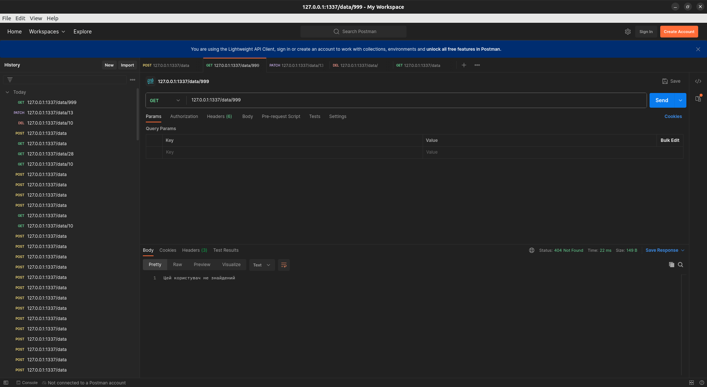

# Тестування працездатності системи

## Запуск системи

    

## POST запит 

    

## GET (отримати всіх користувачів)

    

## GET (по індентифікатору)

    

## PATCH

    

## DELETE

    

## Користувача з таким ІД не існує

    

## Неправильні дані для створення користувача

    

